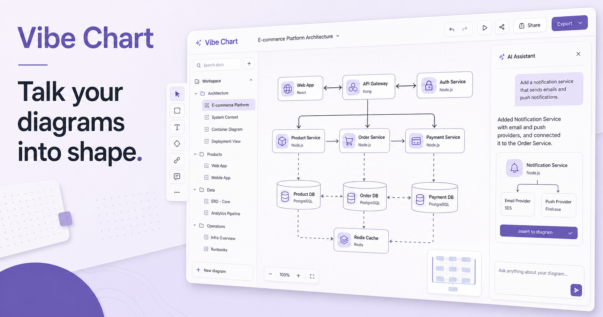

# Vibe Chart

Vibe Chart is an AI-native visual thinking studio for architecture maps,
flowcharts, ER diagrams, sequence diagrams, mind maps, and standalone
whiteboards. It combines direct manipulation with a diagram-aware conversation
layer, while keeping a validated JSON document as the source of truth.



## What works

- Direct node and edge editing on a zoomable canvas
- Architecture, flowchart, ER, sequence, mind map, and whiteboard starting points
- A type switch and template catalog for structured diagrams and open-ended boards
- AI edits through any OpenAI-compatible chat completion endpoint
- Targeted AI edits can use validated ID-level operations, preserving unrelated graph content
- Configurable endpoint, model, and API key stored for the browser tab only
- Canonical typed graph validated before an AI edit reaches the canvas
- Mermaid source and strict-mode rendered preview
- Flowchart, ER, sequence, and mind map Mermaid source applied back to the visual canvas
- Schema-first motion plans with trace/story playback, reduced-motion support, and loop controls
- draw.io XML, Mermaid, PNG, SVG, WebM, GIF, and Vibe JSON export
- Automatic Dagre layout in left-to-right or top-to-bottom direction, plus deterministic mind-map tree/radial layout
- Quality hints for overlaps and blocked edge routes after AI/layout changes
- Undo, redo, duplication, local auto-save, light mode, and dark mode
- Responsive workspace with a compact document rail

## Architecture

Vibe Chart does not treat model-generated Mermaid or draw.io XML as the primary
document. The canonical model is a small, typed workspace document. Graph modes
use nodes and edges; the whiteboard mode uses independently positioned elements
so loose workshop content is not forced into a graph:

```text
AI conversation ─┐
Visual editor ────┼─> validated Vibe JSON ─> graph / whiteboard renderer
Mermaid editor ──┘                         ├> Mermaid (graph + mind map)
                                           ├> draw.io XML (all modes)
                                           ├> PNG / SVG / WebM / GIF
                                           └> local workspace history
```

Motion is deliberately part of the canonical document rather than a canvas-only
effect. A motion plan references stable node and edge IDs, so the same playback
can be previewed, edited by AI, and rendered into WebM or GIF without drifting
from the static diagram. This keeps targeted edits stable and makes every output
adapter deterministic.
See [docs/architecture.md](docs/architecture.md) for the design decisions.

## Local development

Requirements:

- Node.js 22.13 or newer
- npm

```bash
npm install
npm run dev
```

The local workspace opens at `http://localhost:3000`.

## Model configuration

Open the AI panel settings and provide:

- An OpenAI-compatible base URL, such as `https://api.openai.com/v1`
- A model identifier
- An API key, when required

The browser keeps the key in `sessionStorage`, not persistent local storage.
Each request sends it to the same-origin `/api/ai/chart` route, which proxies a
single model request without logging or storing the key.

Hosted deployments can set `VIBE_CHART_API_KEY` and
`VIBE_CHART_BASE_URL` instead. A browser-provided key takes precedence.

Private network endpoints are rejected in production to reduce SSRF risk.
Non-HTTPS public endpoints are rejected in all environments.

## Quality checks

```bash
npm run lint
npm run typecheck
npm test
npm run build
```

`npm run check` runs the full sequence.

## Project structure

```text
app/
  api/ai/chart/       OpenAI-compatible diagram planning endpoint
components/           canvas, directory, inspector, AI, code and toolbar UI
lib/
  diagram-schema.ts   canonical Zod schema and validation
  diagram-code.ts     Mermaid and draw.io adapters
  motion.ts           motion geometry, timelines, and frame interpolation
  motion-export.ts    Canvas-based WebM and GIF renderers
  layout.ts           deterministic Dagre layout
  store.ts            local workspace, undo and redo
tests/                schema, adapter and layout tests
```

## Reference decisions

- [Archify](https://github.com/tt-a1i/archify) inspired the typed IR,
  validation gates, stable IDs, and repair-oriented AI contract.
- [Mermaid](https://github.com/mermaid-js/mermaid) provides portable
  diagram-as-code rendering in strict security mode.
- [draw.io](https://github.com/jgraph/drawio) defines the compatible
  `mxGraphModel` export target.
- [Matplotlib](https://github.com/matplotlib/matplotlib) informed the
  separation between document model, canvas, and output renderers.
- [Lieflat Charts](https://github.com/larashero3-dotcom/lieflat-charts)
  informed the principle that a diagram should communicate one clear reading
  before it adds visual density.
- [Drawnix](https://github.com/plait-board/drawnix) and [Plait](https://github.com/plait-board/x-plait)
  informed the standalone whiteboard boundary, tool palette, local persistence,
  and converter-friendly architecture.
- [tldraw](https://github.com/tldraw/tldraw) informed the separation between
  shapes, tools, bindings, typed store scopes, migrations, and AI context. Its
  SDK is not included because the production license is not MIT by default.

No source code, icon set, or restricted prose is copied from these projects.
Their licenses and trademarks remain with their respective owners.

## License

MIT. See [LICENSE](LICENSE).
